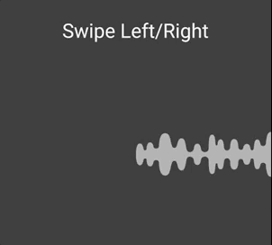
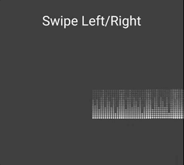

# SoundLine

A custom view which offers an audio timeline controller as the SoundCloud's



## Getting Started

Add the **soundline** module in your project. 

## Usage

In your layout add **prieto.fernando.soundline.SoundLineView** and you can specify the drawable resources ```app:wave_first_src``` and ```app:wave_second_src``` (optional).

- By default, there are 3 different sound waves to use (with three different lengths):
*soundwave_first_default_0.png
soundwave_first_default_1.png
soundwave_first_default_2.png*

- Also 3 default sound waves for the non complete track:
*soundwave_second_default_0.png
soundwave_second_default_1.png
soundwave_second_default_2.png*

## Sample

There is a sample in the project where the sound waves are set *custom_first_default_0* and *custom_second_default_0*



